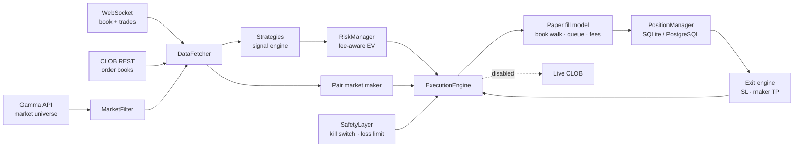

# PolySignal

**An event-driven trading bot for [Polymarket](https://polymarket.com)'s order book, with a realistic paper-trading simulator built to answer one question honestly: _does a strategy actually make money after fees, spread and queue position?_**

Python · asyncio · WebSockets · Polymarket CLOB & Gamma APIs · SQLite/PostgreSQL · Redis · pytest

> ⚠️ **Research project, paper trading only.** Polymarket is restricted in many jurisdictions (including the US, France, the UK and Türkiye). Nothing here is financial advice, and the live-trading path is intentionally left disabled (see [Status](#status)).

---

## What it does

PolySignal scans the full Polymarket universe, enriches the best candidates with live order books, runs a set of strategies, and simulates every order against the real book — with the market's own tick size, minimum order size and fee schedule.

- **Market data**: Gamma API for the market universe, CLOB REST for snapshots, and a WebSocket feed for incremental book updates (`price_change`) and trade prints (`last_trade_price`)
- **Strategies**: a pair market maker (YES + NO), plus directional strategies (news, momentum, volume spikes, order-book imbalance) that can be enabled one at a time
- **Risk layer**: per-trade and per-portfolio exposure caps, fee-aware expected-value gate, cooldowns, a daily loss limit and a kill switch
- **Paper simulator**: taker orders walk the real book, maker orders wait in a queue that only advances on real trades
- **Reporting**: every fill is persisted with fees, slippage and exit reason; `report_paper.py` breaks PnL down per strategy

## Architecture



| Module | Responsibility |
|---|---|
| `app/main.py` | Main loop: scan → enrich → fills → exits → pair MM → signals → execution |
| `app/paper_fill_model.py` | Book walking (FAK), per-market `feeSchedule` taker fees, tick rounding, min order size |
| `app/paper_validation_tracker.py` | Maker queue simulation driven by real trade prints, virtual cash and drawdown |
| `app/websocket_client.py` | Live book maintenance and trade-print capture |
| `app/risk_manager.py` | Sizing, spread caps, fee-aware EV gate, cooldowns |
| `strategies/two_sided_mm_strategy.py` | Pair market maker: quote both outcomes, merge completed pairs, unwind stuck legs |
| `app/safety_layer.py` | Kill switch, daily loss limit, exposure cap, stale-order watchdog |
| `report_paper.py` | Per-strategy PnL, win rate, profit factor and exit breakdown |

## Why the simulator matters

Early versions of this bot reported **+$2,868 on $50 of capital** in paper trading. A careful audit showed the profit came from the simulator, not the strategies:

| Flaw | Fix |
|---|---|
| Taker orders filled at the requested price, no slippage | Orders walk the real book level by level within their limit (fill-and-kill) |
| Take-profits quoted at the ask were "filled" instantly | Maker exits rest on the book like real limit orders |
| Resting orders filled when the mid price merely touched them | Fills only when real trades consume the queue ahead of us, or trade through our price |
| Fees assumed to be 0–0.2% | Each market's `feeSchedule` (`fee = shares · p · rate · (p(1−p))^exp`), up to ~1.75% per taker leg |
| Prices with sub-tick offsets (e.g. 0.5095) | Prices snapped to the market's tick (0.01 or 0.001) |
| Unbalanced YES/NO "pairs" sized in dollars | Pairs sized in shares, so the $1 payout is actually locked |

It also fixed two data bugs that only showed up against the live feed: 98% of WebSocket book updates were silently dropped (the `asset_id` lives inside each `price_change`), and trade prints were never read.

## What the data says

Measurements taken on live Polymarket books in October 2026:

- **Round-trip cost**: buying $2.50 as a taker and selling immediately lost **about 4%** on average across 9 active markets (≈2% spread + ≈2% fees). A directional strategy needs to predict moves larger than that just to break even.
- **Fees**: 91% of the top-100 markets charge taker fees; makers pay none.
- **Queue position**: the best bid on liquid markets often has **10,000–170,000 shares** resting ahead. A small maker order rarely reaches the front.
- **Pair market making**: a completed YES+NO pair bought as maker locks in about 1¢ per share, while unwinding a stuck leg costs 3–6¢. The strategy needs roughly 5–6 completed pairs for every unwind to break even.

These numbers are the point of the project: the tooling makes it cheap to find out that an idea does **not** work before risking money on it.

## Getting started

```bash
python3 -m venv venv && source venv/bin/activate
pip install -r requirements.txt
cp .env.example .env          # keep PAPER_TRADING=True
python -m app.main            # paper trading with the pair market maker
python report_paper.py        # per-strategy results
pytest tests                  # 56 tests, isolated temporary database
```

Useful settings (`.env`):

| Variable | Default | Meaning |
|---|---|---|
| `ENABLED_STRATEGIES` | `TwoSidedMMStrategy` | Comma-separated strategy names, or `all` |
| `PMM_PAIR_SHARES` | `10` | Shares quoted on each leg of a pair |
| `PMM_MIN_PAIR_EDGE` | `0.01` | Minimum `1 − yes − no` per share before quoting |
| `PMM_MAX_MARKETS` | `3` | Markets quoted at once |
| `MAX_TAKER_SPREAD` / `MAX_MAKER_SPREAD` | `0.03` / `0.06` | Entry spread caps, relative to mid |
| `PAPER_INITIAL_CAPITAL` | `50` | Virtual capital |
| `DB_PATH` | `storage/database.db` | Where fills and positions are stored |

## Status

- ✅ Realistic paper trading, fee-aware risk checks, pair market maker, per-strategy reporting, 56 tests
- ⚠️ Live trading is **not** production-ready: aggressive orders are still posted as GTC and assumed filled, and merging completed YES/NO pairs on-chain is not implemented
- ⚠️ No strategy has yet shown a positive expected value over a long paper run

## Lessons learned

1. **Backtests lie in predictable ways.** Optimistic fills, missing fees and ignored queue position can turn a losing strategy into a spectacular one on paper.
2. **Measure against the live system.** Two silent data bugs were only visible by capturing real WebSocket traffic.
3. **More strategies ≠ more profit.** Running one strategy at a time is the only way to attribute results.
4. **Edge scales with capital, not with code.** A real 1¢ edge on $50 is still cents per day.

## Repository layout

```
app/          core engine (data, risk, execution, simulator, safety)
strategies/   trading strategies
tests/        pytest suite (temporary DB, no network)
scratch/      research and audit scripts used during development
storage/      validation reports (runtime DB and logs are git-ignored)
deploy/       supervisor and provisioning scripts
```

---

Built by **Salim Samake** ([@fudamuboy](https://github.com/fudamuboy)).
